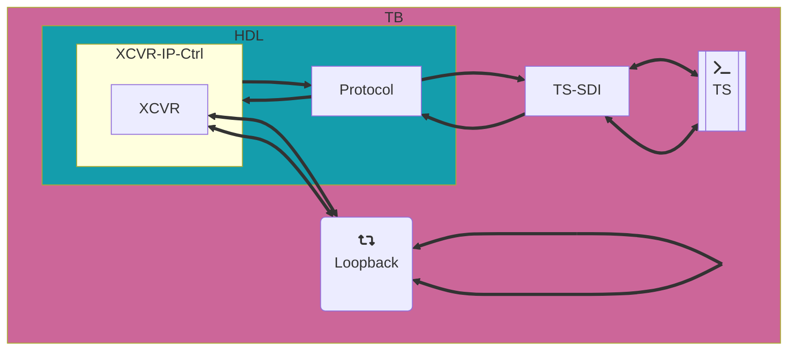

# SDI
Serial Digital Interface FPGA IP core

```mermaid
flowchart LR

    subgraph TB
        direction LR
        TS[[fa:fa-terminal \n TS \n\n]]
        TS-SDI
        subgraph HDL
            direction RL
            Protocol
            subgraph XCVR-IP-Ctrl
                XCVR
            end
        end
        Loop(fa:fa-retweet \n Loopback \n\n)
    end

    TS<==>TS-SDI
    TS-SDI<==>TS
    Protocol==>TS-SDI
    TS-SDI==>Protocol
    Protocol==>XCVR-IP-Ctrl
    XCVR-IP-Ctrl==>Protocol
    Loop<==>XCVR
    XCVR<==>Loop
    Loop<==>Loop

    style HDL fill:#149dac
    style TB fill:#cc6699
```

# Sub-Modules

