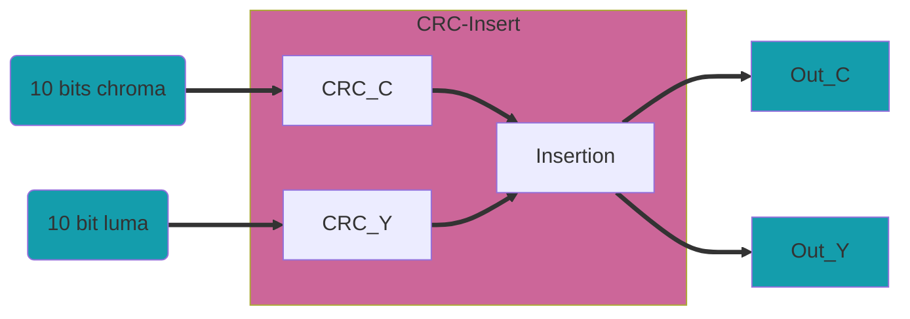

## CRC

### Inserción de CRC

Este módulo `crc_insert` tiene 2 funciones principales. La primera es generar señales de control de temporización para el CRC. Según el estándar HD-SDI, el CRC debe comenzar con la primera palabra después de SAV y finalizar después de la segunda palabra del número de línea.

La señal `crc_en` debe estar activada durante la palabra XYZ de SAV, ya que la siguiente palabra después de la palabra XYZ de SAV es la primera palabra que se incluirá en el cálculo del nuevo CRC.

La segunda función es insertar el CRC en la secuencia de datos después del número de línea. El valor CRC de 18 bits se inserta en dos palabras de 10 bits. Para lograrlo, el octavo bit se niega e inserta al principio de la primera palabra.

Este módulo tiene una latencia de 2 ciclos de reloj, uno de ellos debido al `crc18_smpte`.

|  Bit   |  9   |  8   |  7   |  6   |  5   |  4   |  3   |  2   |  1   |  0   |
|--------|------|------|------|------|------|------|------|------|------|------|
| Word 0 |~crc8 | crc8 | crc7 | crc6 | crc5 | crc4 | crc3 | crc2 | crc1 | crc0 |
| Word 1 |~crc17| crc16| crc15| crc14| crc13| crc12| crc11| crc10| crc9 | crc8 |

### CRC SMPTE de 18 bits

Este módulo `crc18_smpte` calcula el CRC de 18 bits definido en el estándar SMPTE-292M (HD-SDI). Está diseñado con el polinomio *x^18+x^5+x^4+1*. El módulo tiene una latencia de un ciclo de reloj. La entrada `crc_clr` debe estar activada con la primera palabra de un nuevo cálculo.

---------------------------------------------------------------------
