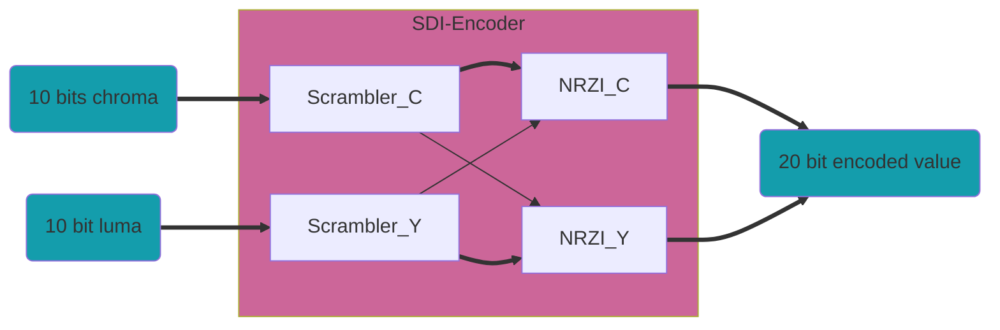

## SDI Encoder

El nivel superior del codificador HD/SD-SDI es `sdi_enc`. Este módulo codifica 20 bits, 10 luma (y) y 10 croma (c); para SD, solo codifica el canal y. El módulo tiene una latencia de dos ciclos de reloj.

Este módulo instancia el Codificador SMPTE `smpte_encoder` y el Codificador NRZ a NRZI `nrz_2_nrzi`.

La salida es de 20 bits, pero para SD, solo los 10 bits menos significativos (LSB) son válidos. El módulo utiliza un reloj de 74.25 MHz.

### Scrambler SMPTE

Este módulo realiza los algoritmos de scrambling SMPTE en datos de 10 bits. Está diseñado para el polinomio *z^9^+z^4^+1* de los estándares SMPTE-259M (SD-SDI) y SMPTE-292M (HD-SDI). Cuando se codifica en HD, se utilizan 2 módulos, pero también es posible utilizar uno solo para codificar ambos canales ejecutando el módulo a una velocidad 2x. Cuando se codifica video SD, se utiliza un solo módulo. El módulo tiene una latencia de un ciclo de reloj.

Cuando se utiliza HD, la entrada `p_scram` del scrambler de croma debe estar conectada a la salida `i_scram_q` del scrambler de luma y la entrada `p_scram` del scrambler de luma debe estar conectada a la salida `i_scram` del módulo de croma. Para SD, la entrada `p_scram` debe estar conectada a la salida `i_scram_q` del mismo módulo.

### Scrambler NRZ a NRZI

Este módulo realiza la conversión de NRZ a NRZI en datos de 10 bits utilizando el polinomio *z+1*. El módulo tiene una latencia de un ciclo de reloj.

Cuando se implementa un codificador HD-SDI, la entrada `p_nrzi` del convertidor de croma debe estar conectada a `data_o(9)` del módulo de luma y la entrada `p_nrzi` del convertidor de luma debe estar conectada a la salida `i_nrzi` del convertidor de croma. Para SD, la entrada `p_nrzi` debe estar conectada a la salida `data_o(9)` de sí mismo.

---------------------------------------------------------------------
