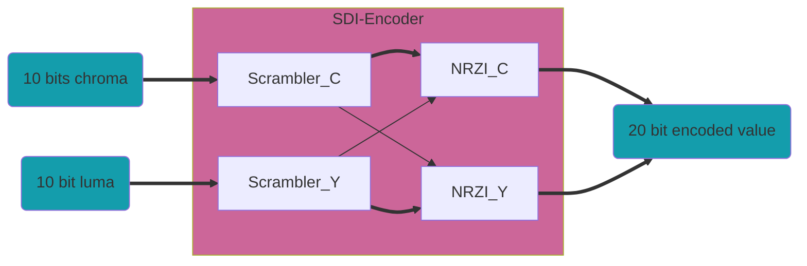

## SDI Encoder

The top level of the HD/SD-SDI encoder is `sdi_enc`.
This module encodes 20 bits, 10 luma (y) and 10 chroma (c), for SD it only encodes the y channel. The module has two clock of latency.

This module instantiates the SMPTE Encoder `smpte_encoder` and the NRZ to NRZI Encoder `nrz_2_nrzi`.

The output is 20 bit, but for SD only the LS 10 b are valid. The module uses 74.25 MHz clock.

### SMPTE Scrambler

This module performs the SMPTE scrambling algorithms on 10 b data. It is designed for the *z^9^+z^4^+1* polynomial of the SMPTE-259M (SD-SDI) and SMPTE-292M (HD-SDI) standards. When encoding HD, 2 modules are used, but it is also possible to use only one to encode both channels by running the module at 2x rate. When encoding SD video, one module is used. The module has one clock of latency.

When using HD, the `p_scram` input of the chroma scrambler must be connected to the `i_scram_q` output of the luma scrambler and the `p_scram` input of the luma scrambler must be connected to the 
`i_scram` output of the chroma module. For SD the `p_scram` input must be connected to the `i_scram_q` output of this same module.

### NRZ to NRZI Scrambler

This module performs the NRZ-to-NRZI conversion on 10 b data by using the *z+1* polynomial. The module has one clock of latency.

 When implementing a HD-SDI encoder, the `p_nrzi` input of the chroma converter must be connected to the `data_o(9)` from 
the luma module and the `p_nrzi` input of the luma converter must be connected to the `i_nrzi` output of the chroma converter. For SD the `p_nrzi` input must be connected to the  `data_o(9)` output of it self.

---------------------------------------------------------------------
