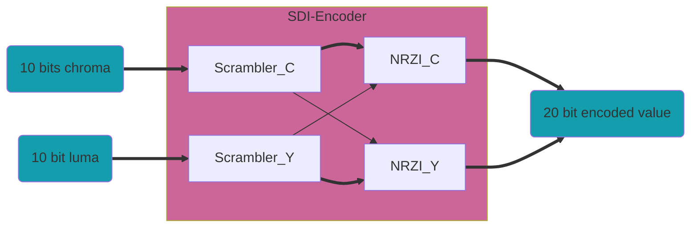

## SDI Encoder

El nivel superior del codificador HD/SD-SDI es `sdi_enc`. Este módulo codifica 20 bits, 10 luma (y) y 10 croma (c); para SD, solo codifica el canal y. El módulo tiene una latencia de dos ciclos de reloj.

Este módulo instancia el Codificador SMPTE `smpte_encoder` y el Codificador NRZ a NRZI `nrz_2_nrzi`.

La salida es de 20 bits, pero para SD, solo los 10 bits menos significativos (LSB) son válidos. El módulo utiliza un reloj de 74.25 MHz.

### Scrambler SMPTE

Este módulo realiza los algoritmos de scrambling SMPTE en datos de 10 bits. Está diseñado para el polinomio *z^9^+z^4^+1* de los estándares SMPTE-259M (SD-SDI) y SMPTE-292M (HD-SDI). Cuando se codifica en HD, se utilizan 2 módulos, pero también es posible utilizar uno solo para codificar ambos canales ejecutando el módulo a una velocidad 2x. Cuando se codifica video SD, se utiliza un solo módulo. El módulo tiene una latencia de un ciclo de reloj.

Cuando se utiliza HD, la entrada `p_scram` del scrambler de croma debe estar conectada a la salida `i_scram_q` del scrambler de luma y la entrada `p_scram` del scrambler de luma debe estar conectada a la salida `i_scram` del módulo de croma. Para SD, la entrada `p_scram` debe estar conectada a la salida `i_scram_q` del mismo módulo.

### Scrambler NRZ a NRZI

Este módulo realiza la conversión de NRZ a NRZI en datos de 10 bits utilizando el polinomio *z+1*. El módulo tiene una latencia de un ciclo de reloj.

Cuando se implementa un codificador HD-SDI, la entrada `p_nrzi` del convertidor de croma debe estar conectada a `data_o(9)` del módulo de luma y la entrada `p_nrzi` del convertidor de luma debe estar conectada a la salida `i_nrzi` del convertidor de croma. Para SD, la entrada `p_nrzi` debe estar conectada a la salida `data_o(9)` de sí mismo.

---------------------------------------------------------------------

## SDI Decoder

El módulo decodificador SDI (`sdi_deco`) admite SD y HD.

Este módulo sigue las normas que definen SDI (SMPTE 259M y SMPTE 292M), que especifica que la secuencia de bits serie se codifica de dos maneras. Primero, se utiliza un polinomio generador de *z^9+z^4+1* para generar una secuencia de bits NRZ. Luego, se emplea un polinomio generador de *z+1* para producir la secuencia NRZI final sin polaridad, que se transmite a través de la capa física.

El módulo decodificador, ubicado al final del enlace SDI, revierte los dos pasos de codificación para extraer los datos originales. Primero, se utiliza el polinomio generador *z+1* para convertir la secuencia de bits de NRZI a NRZ. Luego, se utiliza el polinomio generador *z^9+z^4+1* para descifrar los datos.

En el HD, se decodifican 20 bits en cada ciclo de reloj. En el SD, los 10 bits de datos SD-SDI deben colocarse en los 10 MSB del puerto `data_i`. Se decodifican diez bits en cada ciclo de reloj y los 10 bits decodificados se emiten en los 10 bits MS del puerto `data_o`.

---------------------------------------------------------------------